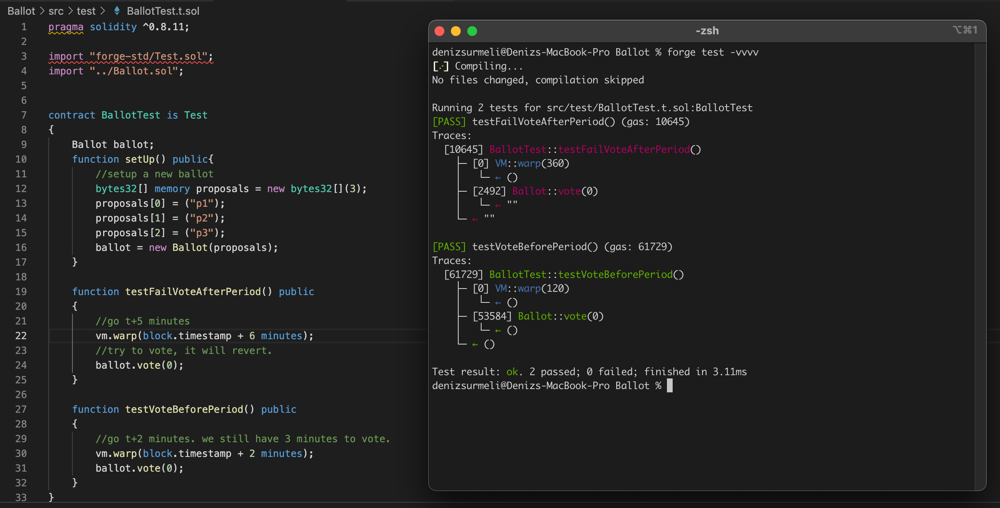

## A.Conceptual Knowledge
- 1) A smart contract is an ethereum account where it's actions are regulated by code, not individuals.Just like any ethereum account it can have balance and send/receive transactions, but also it has EVM code and storage. Remember, these accounts are regulated by EVM code. Contract creation is a form of transaction, since we change the ethereum's global state, we deploy contracts by compiling the source code first, where we will achieve a bytecode. Then we will create a transaction by sending a transaction to the empty address with bytecode as data field. After these steps, we have deployed our contract.
- 2) Gas is the unit cost of the computational operation on the network. We need gas for several reasons.First of all, we should incentivize the miners so that they stay honest and continue to produce blocks. Secondly, we should find a way of ordering and accepting transactions. There is a finite amount of blockspace in a block, this is where the gas comes to the play. Miners accept and order the transactions by the fee that transactions yield. This way, they have a "fair" ordering and accepting the number of transactions. Gas optimization is very important for several reasons. Gas optimization yields advantage for each end of the network. Users spend less ether as transaction fees, miners store less data and compute less, thus their costs are reduced.Also since blocks have limited spaces, optimized calls can allow more transactions to be included in a block. At the end, every party wins.
- 3) A hash is a a fixed-size output for an arbitrary-sized input mapped by a cryptographic function. Hashing information can help you to standardize operations, help for faster and more secure lookups. Think this case. A website calcutates the users password hash in the browser, checks the hash on their database in constant time since it will be a hash table. It's faster since hash table lookups are constant time operations, it is more secure because raw password is not transmitted through network and it's standardized since every key is fixed size. 
- 4) This is an instance of a problem that can be solved by using Zero Knowledge Proofs. Prover, say Allice, wants to prove to the verifier, say Bob, that two pens she's holding is in different colors, but Bob is colorblind. Alice gives the pens Bob and Bob switches them on their back, shows them to Alice. Bob asks to Alice that whether they are switched or not. The probability of identifiying switch is 1/2. If you perform ,say 100 rounds, the probability of she is catching consecutive all switches for 100 rounds is (1/2)^100 = 7.888609052210118e-31 which is a neglible possibility.

## B. You sure you're solid with Solidity ? 
  
- 1)
  [Link to the question's answer in code.](https://github.com/denizsurmeli/zkuapplication/commit/71e875c45d395c7d4718e94e9ae4ebb7774cadcd)
- 2,3,4)[See the source code.](https://github.com/denizsurmeli/zkuapplication/blob/main/Ballot/src/Ballot.sol)

- [The Ballot subdirectory](https://github.com/denizsurmeli/zkuapplication/tree/main/Ballot) contains the tests for showing that modified code works as intented. Here is a secreenshot. 

You can clone the repo and run the tests if you want to !
  